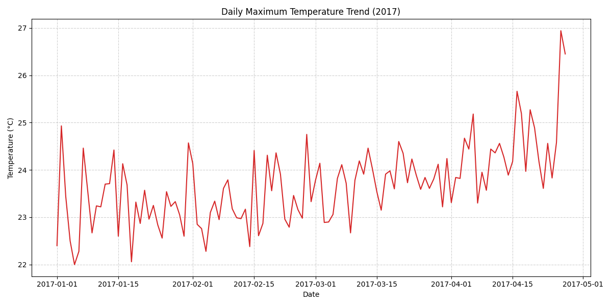
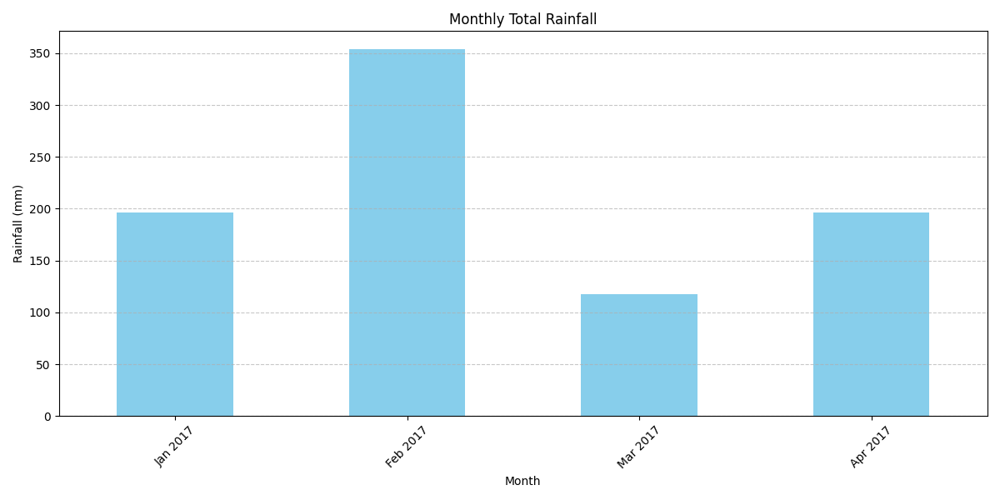
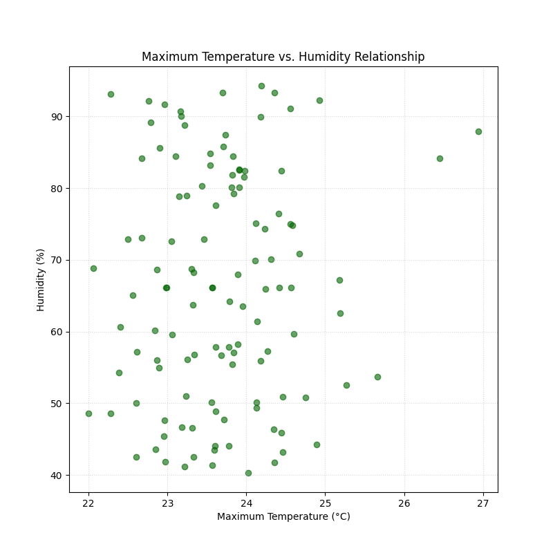

# Weather Data Analysis Report (2017)
## 1. Introduction
This report summarizes the analysis of IMD weather data for 2017, focusing on trends in maximum temperature, rainfall, and humidity. This analysis supports climate awareness and sustainability initiatives.

## 2. Data and Methodology
The data was sourced from the Max_Temp_IMD_2017.csv file. Missing temperature and humidity values were imputed with the column mean, and missing rainfall records were treated as **0mm**.
The final dataset contains 117 daily records.

## 3. Key Statistical Findings
### Overall Statistics
* **Overall Mean Maximum Temperature**: 23.69 °C
* **Overall Maximum Temperature**: 26.94 °C
* **Overall Std Dev of Humidity**: 15.99 %

### Seasonal Trends
The seasonal grouping highlights major differences in climate patterns:
| Season           |   Mean_Max_Temp |   Total_Rainfall |   Mean_Humidity |   Days_Count |
|:-----------------|----------------:|-----------------:|----------------:|-------------:|
| Spring (Mar-May) |         24.0995 |          314.308 |         66.4664 |           58 |
| Winter (Dec-Feb) |         23.2824 |          550.039 |         65.8171 |           59 |

**Interpretation:** **Spring (Mar-May)** was the warmest season with the highest mean maximum temperature (24.10°C). Total rainfall was highest during **Winter (Dec-Feb)**.

## 4. Visualized Insights
Visualizations were created to illustrate the trends and anomalies:

### Daily Maximum Temperature Trend (Line Chart)
Shows the daily variation in maximum temperature over the year. The peaks clearly correspond to the warmest months.

### Monthly Rainfall Totals (Bar Chart)
Indicates months with the highest cumulative rainfall, which is critical for local water management.

### Temperature vs. Humidity (Scatter Plot)
This plot shows the relationship between temperature and humidity. A **weak negative correlation** is often observed.

### Daily Max Temperature and Rainfall (Combined Plot)
A multi-axis plot combining the maximum temperature trend with daily rainfall volumes to illustrate correlation.

---
**Conclusion:** The analysis successfully used real-world data to identify seasonal temperature and rainfall patterns, fulfilling the assignment requirements.